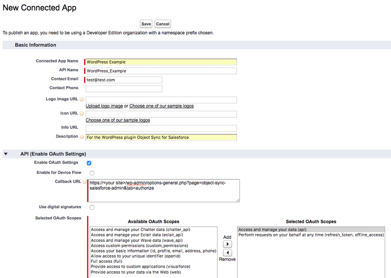
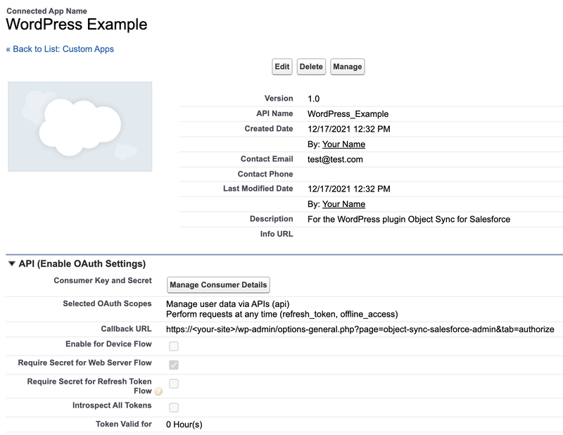

# Initial Setup

## WordPress

### Prerequisites

To install the plugin in WordPress, your PHP environment needs the following:

1. At least version 5.5.
2. SSL support (this is required to connect to Salesforce). You can do this in a local development environment without purchasing a certificate. If you develop on a Mac, you can use [a guide](https://getgrav.org/blog/macos-sierra-apache-ssl) like this one.
3. If you'll be using the SOAP API, PHP needs to be compiled with SOAP web services and
  OpenSSL support, as per:
  - [http://php.net/soap](http://php.net/soap)
  - [http://php.net/openssl](http://php.net/openssl)
4. [Composer](https://getcomposer.org). You'll need to have the composer executable in your path, or be able to call it in another way (one recommended way of doing this is [Homebrew](http://brew.sh/)).
5. A domain where WordPress is successfully running. For purposes of this documentation, we'll assume that you are using `https://<your site>`. You would use `https://www.example.com` instead, if your site was `www.example.com`.
6. If you intend to contribute interface work, for example on the admin settings design, or translation work, to translate all or some of the plugin's text into another language, you will need Node.js and Gulp installed as well. You can use [this guide](https://github.com/gulpjs/gulp/blob/master/docs/getting-started.md) to set it up, and this plugin already includes a `package.json` and `Gulpfile.js`.

*Note*: if you would like to contribute translation work, as defined in #6, but are uncomfortable using Node and Gulp, you can always submit your changes as [one or more issues](https://github.com/minnpost/object-sync-for-salesforce/issues) instead. Please indicate what the text you want to translate currently says, where in the plugin you can find it, what it should say in the additional language, and of course what language it is.

### Install for developers

Most users should install the plugin from the [WordPress plugin directory](https://wordpress.org/plugins/object-sync-for-salesforce/), though developers will often want to install it from the GitHub repository:

1. Run `cd` to get into the `wp-content/plugins` directory of a WordPress install.
2. Run `git clone https://github.com/MinnPost/object-sync-for-salesforce.git`
3. Run `cd object-sync-for-salesforce`
4. Run `composer install`
5. This will take a little while as Composer installs third-party libraries the plugin needs. You can then activate the plugin as you would a normal WordPress plugin.
6. If you are doing interface or translation work, as defined above, run `npm install` to install the Gulp plugins. Run `gulp` when you make changes to Sass, JavaScript, or when you create new translations.
7. If you intent to contribute PHP work, you may want to install [phpDocumentor](https://phpdoc.org/) to generate code documentation. You can use [this link](https://phpdoc.org) to set it up. At this time, it is not included with this plugin. We recommend that you use  `phpDocumentor.phar` and run it in the plugin's root directory when you make relevant changes. You can check these changes in to the Git repository.

### Activate the plugin

Once the plugin is installed, whether from a direct upload of the folder, or from the WordPress plugin directory, you will have a `object-sync-for-salesforce` folder in your `/wp-content/plugins` directory. In the Plugins list in WordPress, you can activate it and find the settings link (you can also find this plugin's settings in the main Settings list in WordPress, under the Salesforce menu item).

By default, the plugin's settings URL is `https://<your site>/wp-admin/options-general.php?page=object-sync-salesforce-admin`.

## Salesforce

### Prerequisites

You'll need to have access to a Salesforce developer account. This should come with Enterprise Edition, Unlimited Edition, or Performance Edition. Developers can register for a free Developer Edition account at [https://developer.salesforce.com/signup](https://developer.salesforce.com/signup).

We recommend using a Sandbox to set up this plugin first before running it in production.

For purposes of this documentation, we'll assume that your name, as defined in Salesforce, is Your Name. This is what you see at the top right of the browser window, when you are logged in.

### Create an App

1. In Salesforce, go to `Your Name > Setup`. Then on the left sidebar, under `App Setup`, click `Create > Apps`. In the **Connected Apps** section of this page, click New to create a new app.
2. Enable OAuth Settings
3. Set the callback URL to: `https://<your site>/wp-admin/options-general.php?page=object-sync-salesforce-admin&tab=authorize` (must use HTTPS).
4. Select at least "Perform requests on your behalf at any time" for OAuth Scope as well as the appropriate other scopes for your application. Many setups will also need to select "Access and manage your data (api)" as one of these scopes.

#### Additional information:
- [https://help.salesforce.com/help/doc/en/remoteaccess_about.htm](https://help.salesforce.com/help/doc/en/remoteaccess_about.htm)
- [https://developer.salesforce.com/page/Getting_Started_with_the_Force.com_REST_API?language=en#Setup](https://developer.salesforce.com/page/Getting_Started_with_the_Force.com_REST_API?language=en#Setup)
- [http://developer.force.com/cookbook/recipe/interact-with-the-forcecom-rest-api-from-php](http://developer.force.com/cookbook/recipe/interact-with-the-forcecom-rest-api-from-php)
- [https://petewarden.com/2010/10/29/how-to-use-the-new-object-sync-for-salesforce-from-php/](https://petewarden.com/2010/10/29/how-to-use-the-new-object-sync-for-salesforce-from-php/)

#### Get the values for WordPress



After you save these settings, click Continue and you'll see the values for your new app. For WordPress, you'll need these values:

1. Consumer Key (in the screenshot, this value says "valuefromsalesforce")
2. Consumer Secret (you'll have to click "Click to reveal" to get this value, as indicated in the screenshot)



**Note:** it can take a few minutes for the app to be fully set up in Salesforce. If you get a `error=invalid_client_id&error_description=client%20identifier%20invalid` URL when you try to authorize with WordPress in the steps below, wait a few minutes and try again.

## Connect the plugin to Salesforce

### Settings

Go to the Settings tab for the plugin. It is the default URL that opens when you click Salesforce in the main Settings menu. Enter the values based on your Salesforce environment.

1. Consumer Key: (your value from above)
2. Consumer Secret: (your value from above)
3. Callback URL: `https://<your site>/wp-admin/options-general.php?page=object-sync-salesforce-admin&tab=authorize`
4. Login Base URL: For most Salesforce environments, you can use `https://test.salesforce.com` for sandbox, and `https://login.salesforce.com` for production.
5. Authorize URL Path: The plugin starts with a default of `/services/oauth2/authorize`. You should generally not have to change this.
6. Token URL Path: The plugin starts with a default of `/services/oauth2/token`. You should generally not have to change this.
7. Salesforce API Version: You should generally use the latest version your install has access to. This plugin starts with 42.0, but once it is authenticated the text field will be replaced with a dropdown of your available versions from which you can choose.
8. Limit Salesforce Objects: These allow you to indicate whether Salesforce should relate to objects that can't be triggered or updated via the API. Generally it's a good idea to have these boxes checked to avoid errors.
9. Salesforce Field Display Value: When mapping Salesforce fields, you can choose whether the plugin will display a field's Field Label (possibly a more user friendly value) or the API Name (which is always unique). Neither choice changes how the plugin functions on the back end, but making a choice can sometimes make the mapping choices easier to find.
10. Pull Throttle (seconds): This plugin starts with 5 seconds, but you can change it based on your server's needs.
11. Debug mode: This won't do anything until after the plugin has been authorized, but once it has you can use it to see more information about what the API is doing. **Don't check this in a production environment.**

Save the settings. If the values required are set, you'll see a message that says "Salesforce needs to be authorized to connect to this website. Use the Authorize tab to connect." You can use that link for the next steps.

#### Using constants for settings

You can set several of the above values as constants in your `wp-config.php` file. The plugin will always use a constant ahead of a database setting.

Supported constant names are:

1. OBJECT_SYNC_SF_SALESFORCE_CONSUMER_KEY
2. OBJECT_SYNC_SF_SALESFORCE_CONSUMER_SECRET
3. OBJECT_SYNC_SF_SALESFORCE_CALLBACK_URL
4. OBJECT_SYNC_SF_SALESFORCE_LOGIN_BASE_URL
5. OBJECT_SYNC_SF_SALESFORCE_AUTHORIZE_URL_PATH
6. OBJECT_SYNC_SF_SALESFORCE_TOKEN_URL_PATH
7. OBJECT_SYNC_SF_SALESFORCE_API_VERSION

Set them in `wp-config.php` like this:

```php
define('OBJECT_SYNC_SF_SALESFORCE_CONSUMER_KEY', 'valuefromsalesforce');
define('OBJECT_SYNC_SF_SALESFORCE_CONSUMER_SECRET', 'valuefromsalesforce');
define('OBJECT_SYNC_SF_SALESFORCE_CALLBACK_URL', 'https://<your site>/wp-admin/options-general.php?page=object-sync-salesforce-admin&tab=authorize');
define('OBJECT_SYNC_SF_SALESFORCE_LOGIN_BASE_URL', 'https://test.salesforce.com');
define('OBJECT_SYNC_SF_SALESFORCE_API_VERSION', '42.0');
define('OBJECT_SYNC_SF_SALESFORCE_AUTHORIZE_URL_PATH', '/services/oauth2/authorize');
define('OBJECT_SYNC_SF_SALESFORCE_TOKEN_URL_PATH', '/services/oauth2/token');
```

For any value that is already defined in `wp-config.php`, the Settings screen will display "Defined in wp-config.php" in place of the text field.

### Authorize

Go to the Authorize tab in the plugin's settings. If it is not yet authorized, you'll see a message that says "Salesforce needs to be authorized to connect to this website. Use the Authorize tab to connect."

The authorize tab will force you to be logged in using HTTPS, if you weren't already.

Steps:

1. Click the Connect to Salesforce button to authenticate WordPress with your Salesforce installation.
2. You may have to log into Salesforce.
3. Salesforce will ask you to allow access to the app (in these instructions, the name is WordPress Example), and will show you what permissions it needs.
4. Click Allow.
5. You'll be redirected back to WordPress. Don't do anything until you see a message that says "Salesforce is successfully authenticated."
6. The tab will display a "Disconnect from Salesforce" button which you can click at any time, and will also show a bit of basic information about your Salesforce environment (the available API versions and a basic table of Contacts.)
7. If you'd like to use a different Salesforce API version, go back to the Settings tab and pick your desired version from the dropdown.
