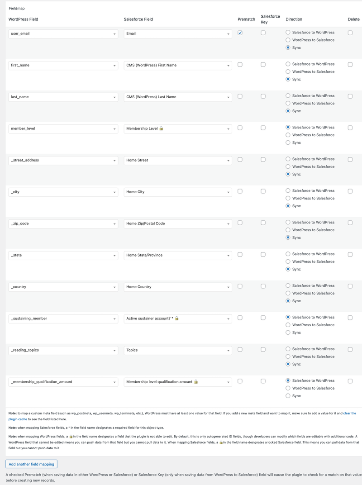

# Mapping objects

This plugin refers to mapped objects - objects that share data between WordPress and Salesforce in one direction, or both - as fieldmaps. A fieldmap is the broad category of object to object pairs. A Salesforce Contact can be a fieldmap with a WordPress user, for example.

One instance of a fieldmap - a single Salesforce Contact that shares data with a single WordPress user - is an object map. This language is shared with the [Drupal Salesforce Suite](https://github.com/thinkshout/salesforce) on which this plugin is based. Object map terminology does not appear in the plugin's admin interface, but it is how the database is structured.

Together, these mappings determine what the plugin should do when [`push`](./push.md) and [`pull`](./pull.md) events happen.

## Create/edit a fieldmap

Use the Fieldmaps tab of the plugin settings, and click Add New to create a new fieldmap. This initial load can take a while, if the plugin needs to refresh its cached Salesforce data. The screen is the same if you edit an existing fieldmap, but it will already have data.

The settings for a WordPress fieldmap work like this:

1. Label: you can use any text (up to 64 characters) for this. Make it unique.
2. WordPress object: the plugin gets every object it is aware of from your WordPress installation. See [below](#more-on-wordpress-object) for more.
3. Salesforce object: the plugin gets every Salesforce object it has access to. **Some objects add a dropdown field with a list of date fields to trigger "pull" actions.** See [below](#more-on-salesforce-object) for more.
4. Fieldmap: choose which fields from the WordPress object map to fields from the Salesforce object, and how the plugin should treat changes. See [below](#more-on-field-mapping) for more.
5. Action triggers: the plugin can sync data when a record is changed in WordPress and/or Salesforce.
6. Process asynchronously: whether push data will be sent to Salesforce immediately, or when `wp_cron` runs.
7. Push drafts: many WordPress objects create and save drafts while editing is happening. By default, this data is not sent to Salesforce. Checking the box causes it to be synced equally to live items.
8. Weight: if the same object is mapped multiple times, the weight will determine what happens first. This is in ascending order, so objects with higher numerical values will be mapped after objects with lower numerical values.

Several hooks exist for modifying these options. See the [extending mapping options documentation](./extending-mapping-options.md).

### More on WordPress object

By default, this includes: user, comment, category, tag, post, any other post types built into WordPress, and any custom post types that have been added by the default WordPress conventions. You can see more about this in the [WordPress documentation](https://codex.wordpress.org/Post_Types).

The plugin also has hooks to modify what objects are included. You can read more about these in the [extending mapping options documentation](./extending-mapping-options.md#available-wordpress-objects).

### More on Salesforce object

What is contained in this list depends partly on the authenticated Salesforce user's permissions, and partly on what the plugin's settings do with objects that can't be triggered and/or updated (see the [setup documentation](./setup.md) for more. This list is not currently able to be modified by developer hooks.

The date fields to trigger a pull request are how the plugin finds Salesforce records in mapped objects that have been updated since the last `wp_cron` run. For example, if you map WordPress users to Salesforce Contacts, this date field will allow the plugin to get all Contacts that have been updated since that last run.

### More on field mapping

#### Wordpress fields

WordPress does not currently have a way to get all fields from an object. This plugin attempts to do this by combining the fields from an object's main table (`wp_posts`, `wp_users`, etc.) with the metadata for that object (`wp_postmeta`, `wp_usermeta`, etc.). This isn't perfect, but it gets most fields.

The plugin also has a hook to modify what fields are included for an object. You can read more about this in the [extending mapping options documentation](./extending-mapping-options.md#available-wordpress-fields).

#### Salesforce fields

Salesforce fields come from the `object_describe` API method.

#### Other configuration

Prematch determines whether the field should be used to match objects. If it is checked, the plugin will see objects that share a value in that pair to be matched.

A Salesforce Key is a flag in Salesforce that determines whether a field is another system's external ID.

A checked Prematch or Salesforce Key will cause the plugin to try to "upsert" the data, which checks to see if there is a match before creating a new record.

Direction chooses what to do with the field's data. If you select Salesforce to WordPress, this field won't be sent to Salesforce. If you select WordPress to Salesforce, this field won't be sent to Wordpress. If you choose Sync, it will go from one system to the other whenever it changes.

Delete allows you to delete that fieldmap when you save the settings at the bottom of the page.